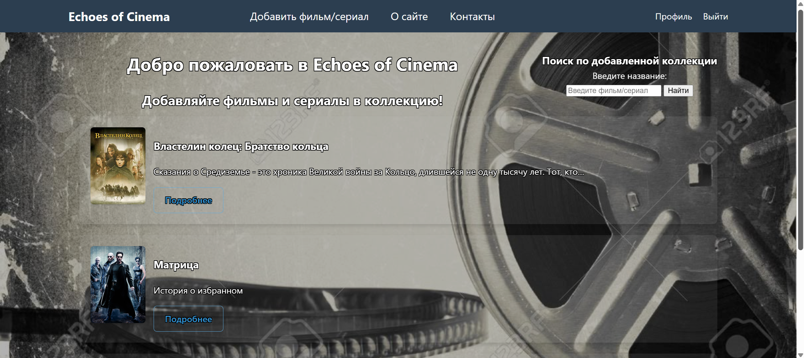
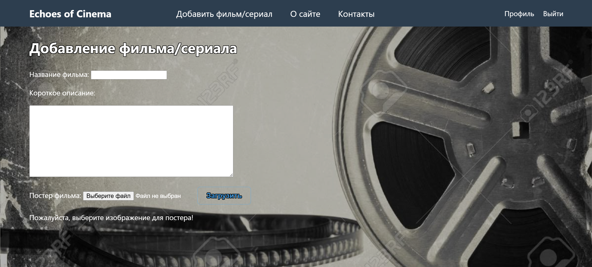

# Echoes of Cinema


## Скриншоты




## Описание
📽 EchoesOfCinema — API для каталога фильмов

EchoesOfCinema — это учебно-практический проект на Django, который стараюсь дорабатывать до backend с REST API, аутентификацией JWT, Swagger документацией, тестами и CI/CD через GitHub Actions.
Проект демонстрирует навыки разработки серверного API на Django Rest Framework, работу с пользователями, CRUD-операции, пагинацию, авторизацию и тестирование.

## 🚀 Функционал

🎬 API фильмов

- Получение списка фильмов
- Пагинация
- Просмотр одного фильма
- Создание, редактирование, удаление (для авторизованных пользователей)
- Управление slug
- Защита:
   🔓 аноним — только чтение
   🔐 владелец — CRUD
   🛡 админ — полный доступ

🔐 Авторизация
- JWT токены:
    - /api/v1/token/
    - /api/v1/token/refresh/
    - /api/v1/token/verify/

📄 Swagger / OpenAPI документация
Полностью автогенерируемая схема:
    Swagger UI:
      - /api/v1/docs/
    OpenAPI схема (yaml):
      - /api/v1/schema/

🧪 Тестирование (pytest + DRF APIClient)
Покрыто:
- получение фильмов
- подробный просмотр
- авторизация
- создание/редактирование
- удаление
- slug-валидация
- проверки прав доступа

🔄 CI/CD
GitHub Actions автоматически:
   1. устанавливает зависимости
   2. запускает Django
   3. выполняет миграции
   4. запускает pytest

Файл workflow лежит в .github/workflows/tests.yml

## 🧱 Технологии
- Python 3.12
- Django 5
- Django REST Framework
- SimpleJWT
- drf-spectacular (Swagger)
- pytest
- GitHub Actions
- SQLite (dev)

## 📌 API Эндпоинты
🎬 Movies API

Метод	URL	                    Доступ	            Описание
GET	    /api/v1/movies/	        Все	                Список фильмов (пагинация)
POST	/api/v1/movies/	        Авторизованные	    Создать фильм
GET	    /api/v1/movies/<id>/	Все	                Детальный просмотр
PUT	    /api/v1/movies/<id>/	Владелец / админ	Обновить фильм
DELETE	/api/v1/movies/<id>/	Владелец / админ	Удалить фильм

## 🔐 Авторизация (JWT)
Получение токена
POST /api/v1/token/ {"username": "user", "password": "pass"}

Обновление токена
POST /api/v1/token/refresh/

Проверка токена
POST /api/v1/token/verify/

## 🧪 Тестирование
Запустить тесты:

pytest -v

Основные группы тестов:

- CRUD фильмов
- JWT авторизация
- Доступы (владелец / админ / аноним)
- Пагинация
- Валидация
- Unique slug

## 🔄 CI/CD (GitHub Actions)

В проект включён workflow, который запускается при каждом пуше:

name: Django Tests
runs-on: ubuntu-latest
steps:
  - uses: actions/checkout@v3
  - uses: actions/setup-python@v4
    with:
      python-version: 3.12
  - run: pip install -r requirements.txt
  - run: python manage.py migrate
  - run: pytest

## 📘 API документация (Swagger)

После установки drf-spectacular доступно:

Swagger UI

🔗 http://127.0.0.1:8000/api/v1/docs/

OpenAPI схема

🔗 http://127.0.0.1:8000/api/v1/schema/

Документация генерируется автоматически.

## 🗺 Roadmap

🚀 В планах:

- Фильтрация фильмов по жанрам, тегам, году
- Рейтинг фильмов
- Комментарии
- Deploy на Render / Railway / Docker Hub
- Перевод API на FastAPI


## Запуск проекта
1. Создайте виртуальное окружение: `python -m venv .venv`
2. Активируйте: `source .venv/bin/activate` (Linux/Mac) или `.venv\Scripts\activate` (Windows)
3. Перейдите в директорию с проектом: `cd <Буква Диска>\Projects\<Имя проекта>\<Директория проекта>`
4. Установите зависимости: `pip install -r requirements.txt`
5. Создайте суперпользователя: `python manage.py createsuperuser`
6. Запустите миграции: `python manage.py migrate`
7. Запустите сервер: `python manage.py runserver`

## Запуск через Docker
1. Убедитесь, что [Docker](https://www.docker.com/) и [Docker Compose](https://docs.docker.com/compose/install/) установлены.

2. Клонируйте репозиторий:
   ```bash
   git clone https://github.com/VladTyukilin/EchoesOfCinema.git
   ```
   
3. Перейдите в директорию проекта:
   ```bash
   cd EchoesOfCinema
   ```
   
4. Соберите и запустите контейнер:
   ```bash
   docker-compose up --build
   ```
   
5. Откройте в браузере:
   http://localhost:8000

💡 При первом запуске Docker автоматически применит миграции и запустит сервер

или

Вариант через `docker run` требует ручного применения миграций 

1. Соберите образ: `docker build -t echoesofcinema .`
2. Запустите контейнер: `docker run -p 8000:8000 echoesofcinema`
3. Перейдите в браузере по адресу: `http://localhost:8000`

## Настройка окружения
1. Создайте файл `.env` на основе шаблона:
   ```bash
   cp .env.example .env  # Linux/Mac
   copy .env.example .env  # Windows (cmd)
   ```

2. Сгенерируйте SECRET_KEY с помощью:
   ```bash
   python -c "from django.core.management.utils import get_random_secret_key; print(get_random_secret_key())"
   ```   

3. Укажите `DEBUG=True`


## Статические файлы

Для работы со статическими файлами:
1. Убедитесь, что STATIC_ROOT настроен в settings.py
2. Соберите статику: `python manage.py collectstatic`


## 📂 Структура проекта
```
echoesofcinema/                 # Основной Django-проект

├── .github/                      
│   └──workflows
│       └── django-tests.yml
│
├── echoesofcinema/             # Настройки проекта
│   ├── __init__.py
│   ├── settings.py
│   ├── urls.py
│   ├── asgi.py
│   └── wsgi.py
│
├── htmlcov/  
│
├── media/                      # Загруженные файлы (постеры)
│   └── posters/
│
├── movie/                      # Приложение: управление фильмами и сериалами
│   ├── api/
│   │   ├── tests/
│   │   │   ├── permissions.py
│   │   │   ├── serializers.py
│   │   │   ├── urls.py
│   │   │   ├── views.py
│   │   │   └── __init__.py
│   │   ├── permissions.py
│   │   ├── serializers.py
│   │   ├── urls.py
│   │   ├── views.py
│   │   └── __init__.py
│   │
│   ├── fixtures/               # Фикстуры для тестов
│   │   ├── movie_movie.json
│   │   └──  auth_user.json
│   │
│   ├── migrations/               
│   │
│   ├── static/                 # Статические файлы (CSS, JS, изображения)
│   │   └── movie/           
│   │       ├── css/
│   │       ├── js/
│   │       └── img/
│   │   
│   ├── templates/              # HTML-шаблоны
│   │   └── movie/        
│   │       ├── index.html
│   │       ├── post.html
│   │       ├── add_movie.html
│   │       ├── about.html
│   │       ├── contact.html
│   │       ├── list_categories.html
│   │       ├── list_tags.html
│   │       └── success.html
│   │
│   ├── tests/                  # Статические файлы (CSS, JS, изображения)
│   │   ├── __init__.py
│   │   ├── test_mainpage.py
│   │   ├── test_models.py
│   │   ├── test_pages.py
│   │   ├── test_register_user.py
│   │   └── test_views.py
│   │
│   ├── __init__.py
│   ├── models.py               # Модели данных
│   ├── views.py                # Представления
│   ├── urls.py                 # Маршруты
│   ├── forms.py                # Формы
│   ├── admin.py                # Админка
│   ├── apps.py
│   ├── utils.py
│   └── menu.py
│
├── petvenv/
│
├── screenshots/
│
├── templates/
│   └── base.html
│       
├── users/                      # Приложение: регистрация и аутентификация
│   ├── __init__.py
│   ├── views.py
│   ├── urls.py
│   ├── forms.py
│   └── templates/              # Шаблоны пользовательских страниц
│ 
├── .coverage
├── .dockerignore
├── .env.example                # Пример файла окружения
├── .gitignore
├── db.sqlite3
├── docker-compose.yml          # Запуск через Docker Compose
├── Dockerfile                  # Конфигурация Docker-образа
├── manage.py
├── pytest.ini
├── README.md
└── requirements.txt            # Зависимости Python
```